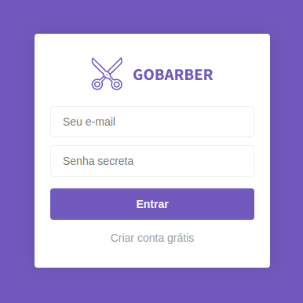

# GoBarber

Gobarber is a barber reservation system that connects your customers to your calendar.

Made with NodeJS.

## Installation

1. Clone the project. `git clone https://github.com/JKFher/GoBarber.git`.
2. Install all the dependencies. `yarn` or `npm i`.
3. Change the Database config file.
4. Start the application. `yarn dev` or `npm run dev`.
5. Have fun!

## Contributing
Pull requests are welcome. For major changes, please open an issue first to discuss what you would like to change.

Please make sure to update tests as appropriate.

## License
[MIT](https://choosealicense.com/licenses/mit/)
